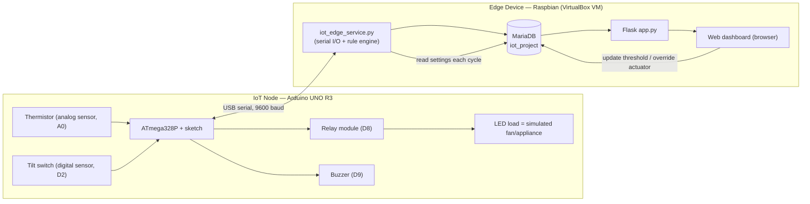
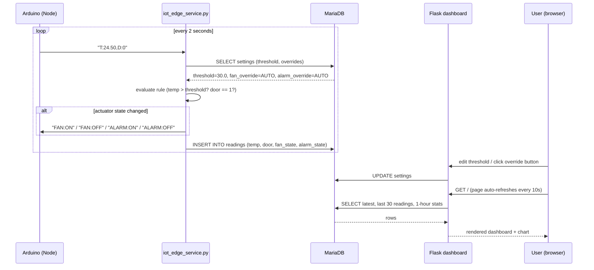
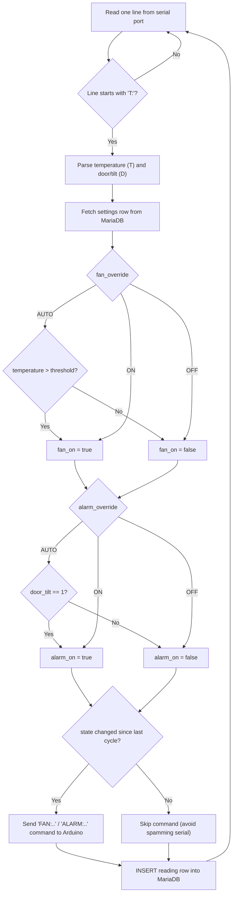

# 2. Conceptual Design

Use these three diagrams (rendered directly by GitHub) as the "Conceptual
design" figures in your report. Screenshot them or re-draw them in
draw.io/Lucidchart if your report format needs static images.

## 2.1 System block diagram (hardware/software architecture)

**Narrative:** the Node is a pure sense-and-act device — it has no logic
beyond reading pins and obeying ON/OFF commands. All decision-making
("edge analytics") happens in `iot_edge_service.py` on the Pi, which is the
architecture the assignment asks for (IoT Node ⇄ Edge Device). The database
is the shared state between the analytics service and the dashboard: the
service writes readings and reads settings; the dashboard reads readings and
writes settings. Neither talks to the other directly, which avoids two
processes fighting over the same serial port.

## 2.2 Sequence diagram — one control loop

## 2.3 Edge analytics rule — flowchart

## 2.4 Technology stack

| Layer | Technology | Reason |
|---|---|---|
| IoT Node firmware | C++ (Arduino core) | Direct, low-level control of ADC and GPIO pins; standard for UNO |
| Node ⇄ Edge link | USB serial, plain-text protocol, 9600 baud | Simple to debug with Serial Monitor; no extra hardware (Wi-Fi/BLE modules) needed |
| Edge runtime | Python 3 (`pyserial`, `mysql-connector-python`) | Readable, fast to prototype, good DB/serial libraries |
| Database | MariaDB (MySQL-compatible) | Matches the assignment's recommended client; relational schema fits fixed-shape sensor rows |
| Dashboard | Flask + Jinja2 + Chart.js | Lightweight web server suitable for a Pi; Chart.js gives a live-updating line chart with minimal code |
