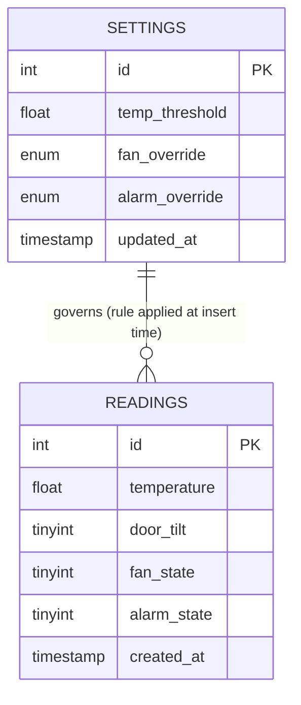

# 6. Database & Edge Analytics

## 6.1 Schema

File: [`edge/db/schema.sql`](../edge/db/schema.sql)



- **`readings`** — one row per sensor report received from the Node
  (task 3B: "database is able to save the data read from the sensors").
  `fan_state`/`alarm_state` record what the rule engine *decided* for that
  cycle, so the history log doubles as an actuator audit trail.
- **`settings`** — a single row (`id = 1`) holding the live automation
  rule (`temp_threshold`) and manual overrides. Kept separate from
  `readings` because it is mutated by the dashboard, not appended to.

## 6.2 Installing MariaDB and loading the schema

See [docs/08](08-raspbian-vm-setup-guide.md) for the full install sequence.
In short:

```bash
sudo apt install mariadb-server -y
sudo mysql_secure_installation
sudo mysql -u root -p < edge/db/schema.sql
```

`schema.sql` creates the database, both tables, a seed settings row
(`temp_threshold = 30.0`, both overrides `AUTO`), and a dedicated
`iot_user` database account (edit the password in the file **before**
running it — see the comment at the top of the file).

## 6.3 Edge analytics — the conditional rule

File: [`edge/iot_edge_service.py`](../edge/iot_edge_service.py)

This is the "simple edge analytics" component (task 4): a Python process
running continuously on the Raspberry Pi/VM that:

1. Blocks on `ser.readline()` until the Node sends its next `T:..,D:..` line.
2. Looks up the current rule from the `settings` table.
3. Evaluates the rule:
   - **Fan rule:** `fan_on = temperature > temp_threshold` (unless a manual
     override forces it ON or OFF).
   - **Alarm rule:** `alarm_on = (door_tilt == 1)` (unless overridden).
4. If either decision differs from last cycle, sends the corresponding
   `FAN:..`/`ALARM:..` command back to the Node.
5. Inserts one row into `readings` recording the sensor values *and* the
   decided actuator states.

This satisfies task 4C ("simple conditional rule... signal to... operate an
actuator on an IoT Node") directly: temperature above a threshold signals
the fan; a tilt/door trigger signals the alarm.

## 6.4 Making the rule changeable (task 4D / 5D)

The threshold and both overrides live in the database, not hard-coded in
the Python script. The dashboard's **"Save rule"** form runs
`UPDATE settings SET temp_threshold = %s WHERE id = 1`, and the **manual
override buttons** run the same style of update against `fan_override` /
`alarm_override`. Because `iot_edge_service.py` re-reads the `settings` row
on *every* cycle (every ~2 seconds), a change made in the browser takes
effect within one or two sensor reports — no restart needed. This is what
lets you demonstrate, live in your video, changing the rule from the UI and
watching the physical actuator react.

## 6.5 Extending the analytics (optional, for higher marks)

If you want to go beyond a single fixed threshold, straightforward
additions that fit this schema without redesigning anything:

- **Hysteresis:** turn the fan on above `threshold` but only off below
  `threshold - 2`, to stop relay chatter near the boundary.
- **Rolling average:** compute the mean of the last N readings in Python
  before comparing to the threshold, to smooth sensor noise.
- **Time-window analytics:** the dashboard already computes mean/min/max
  over the last hour with a single SQL query (see
  [docs/07](07-web-dashboard.md)) — you could add a `GROUP BY HOUR(...)`
  query for an hourly trend table.
